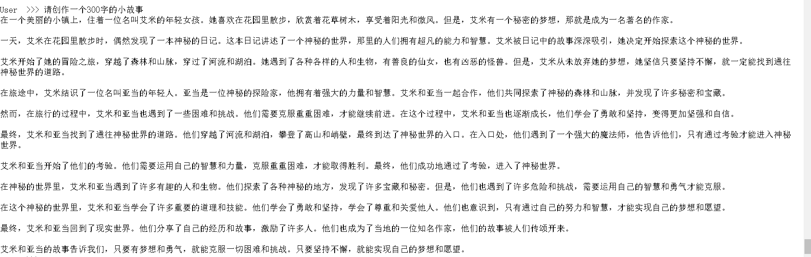
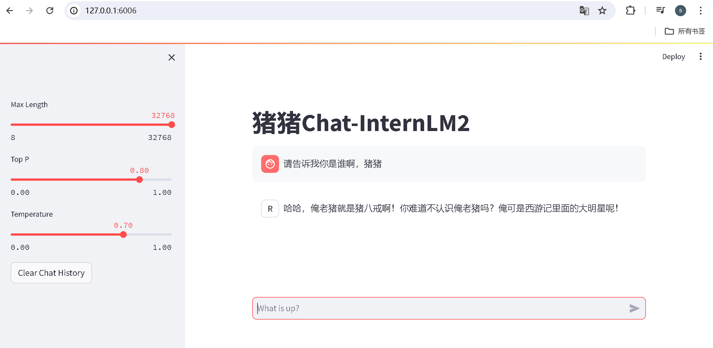

# 第二课 轻松玩转书生·浦语大模型趣味 Demo
## 前期准备
配置虚拟环境（初始配置使用10%算力的配置即可）
```shall
studio-conda -o internlm-base -t demo
```
激活虚拟环境
```shall
conda activate demo
```
安装程序运行所需要的相关pkg
```shall
pip install huggingface-hub==0.17.3
pip install transformers==4.34 
pip install psutil==5.9.8
pip install accelerate==0.24.1
pip install streamlit==1.32.2 
pip install matplotlib==3.8.3 
pip install modelscope==1.9.5
pip install sentencepiece==0.1.99
```
## 下载 InternLM2-Chat-1.8B 模型
在 /root 目录下创建demo目录，并添加2个py文件分别是命令行脚本和模型下载脚本，后续模型和运行代码会放置在这个目录中
```shall
mkdir -p /root/demo
touch /root/demo/cli_demo.py
touch /root/demo/download_mini.py
cd /root/demo
```
通过左侧文件夹栏目，双击进入 demo 文件夹。并双击download_mini.py 文件，复制以下代码：
```python
import os
from modelscope.hub.snapshot_download import snapshot_download

# 创建保存模型目录
os.system("mkdir /root/models")

# save_dir是模型保存到本地的目录
save_dir="/root/models"

snapshot_download("Shanghai_AI_Laboratory/internlm2-chat-1_8b", 
                  cache_dir=save_dir, 
                  revision='v1.1.0')
```
该脚本使用了魔搭社区的模型下载sdk，用来下载指定的模型，执行脚本并下载模型，需要耐心等待。
```shall
python /root/demo/download_mini.py
```
## 第一个demo：命令行体验1.8B模型创建一个300字的小故事
双击左侧demo文件夹内的cli_demo.py，并复制如下代码：
```python
import torch
from transformers import AutoTokenizer, AutoModelForCausalLM

#模型地址
model_name_or_path = "/root/models/Shanghai_AI_Laboratory/internlm2-chat-1_8b"

tokenizer = AutoTokenizer.from_pretrained(model_name_or_path, trust_remote_code=True, device_map='cuda:0')
model = AutoModelForCausalLM.from_pretrained(model_name_or_path, trust_remote_code=True, torch_dtype=torch.bfloat16, device_map='cuda:0')
model = model.eval()

system_prompt = """You are an AI assistant whose name is InternLM (书生·浦语).
- InternLM (书生·浦语) is a conversational language model that is developed by Shanghai AI Laboratory (上海人工智能实验室). It is designed to be helpful, honest, and harmless.
- InternLM (书生·浦语) can understand and communicate fluently in the language chosen by the user such as English and 中文.
"""

messages = [(system_prompt, '')]

print("=============Welcome to InternLM chatbot, type 'exit' to exit.=============")

while True:
    input_text = input("\nUser  >>> ")
    input_text = input_text.replace(' ', '')
    if input_text == "exit":
        break

    length = 0
    for response, _ in model.stream_chat(tokenizer, input_text, messages):
        if response is not None:
            print(response[length:], flush=True, end="")
            length = len(response)
```
输入命令，执行 Demo 程序：
```shall
python /root/demo/cli_demo.py
```
等待模型加载，并出现提示词：User  >>>
输入文本：
```text
请创作一个 300 字的小故事
```
最终结果如下：

输入exit退出demo
demo1 至此完成
# 第二个demo 八戒-Chat-1.8B 模型
这次使用git命令来获取demo项目代码
```shall
cd /root/
git clone https://gitee.com/InternLM/Tutorial -b camp2
cd /root/Tutorial
```
下载运行 Chat-八戒 Demo
```shall
python /root/Tutorial/helloworld/bajie_download.py
```
八戒demo使用 streamlit web 框架，运行
```shall
streamlit run /root/Tutorial/helloworld/bajie_chat.py --server.address 127.0.0.1 --server.port 6006
```
同时需要配置本地ssh映射网络端口，先打开本地windeos：powershell或mac：终端，输入以下命令：
```shall
# 从本地使用 ssh 连接 studio 端口
# 将下方端口号 44533 替换成自己的端口号,端口号在开发机界面查看
ssh -CNg -L 6006:127.0.0.1:6006 root@ssh.intern-ai.org.cn -p 44533
```
打开 http://127.0.0.1:6006 后，等待加载完成即可进行对话，键入内容示例如下：
```text
请告诉我你是谁啊，猪猪
```
最终结果如下：

关闭网页，并在web ide 中ctrl+c 退出demo