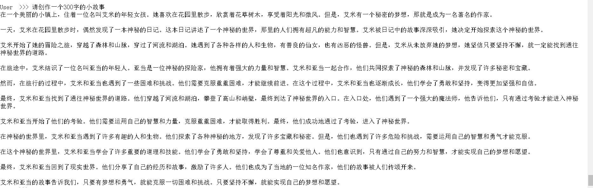
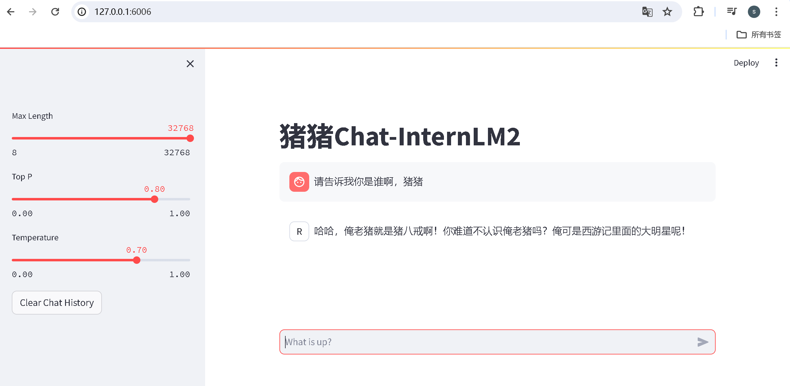

# 第二课 轻松玩转书生·浦语大模型趣味 Demo
## 前期准备
配置虚拟环境（初始配置使用10%算力的配置即可）
```shall
studio-conda -o internlm-base -t demo
```
激活虚拟环境
```shall
conda activate demo
```
安装程序运行所需要的相关pkg
```shall
pip install huggingface-hub==0.17.3
pip install transformers==4.34 
pip install psutil==5.9.8
pip install accelerate==0.24.1
pip install streamlit==1.32.2 
pip install matplotlib==3.8.3 
pip install modelscope==1.9.5
pip install sentencepiece==0.1.99
```
## 下载 InternLM2-Chat-1.8B 模型
在 /root 目录下创建demo目录，并添加2个py文件分别是命令行脚本和模型下载脚本，后续模型和运行代码会放置在这个目录中
```shall
mkdir -p /root/demo
touch /root/demo/cli_demo.py
touch /root/demo/download_mini.py
cd /root/demo
```
通过左侧文件夹栏目，双击进入 demo 文件夹。并双击download_mini.py 文件，复制以下代码：
```python
import os
from modelscope.hub.snapshot_download import snapshot_download

# 创建保存模型目录
os.system("mkdir /root/models")

# save_dir是模型保存到本地的目录
save_dir="/root/models"

snapshot_download("Shanghai_AI_Laboratory/internlm2-chat-1_8b", 
                  cache_dir=save_dir, 
                  revision='v1.1.0')
```
该脚本使用了魔搭社区的模型下载sdk，用来下载指定的模型，执行脚本并下载模型，需要耐心等待。
```shall
python /root/demo/download_mini.py
```
## 第一个demo：命令行体验1.8B模型创建一个300字的小故事
双击左侧demo文件夹内的cli_demo.py，并复制如下代码：
```python
import torch
from transformers import AutoTokenizer, AutoModelForCausalLM

#模型地址
model_name_or_path = "/root/models/Shanghai_AI_Laboratory/internlm2-chat-1_8b"

tokenizer = AutoTokenizer.from_pretrained(model_name_or_path, trust_remote_code=True, device_map='cuda:0')
model = AutoModelForCausalLM.from_pretrained(model_name_or_path, trust_remote_code=True, torch_dtype=torch.bfloat16, device_map='cuda:0')
model = model.eval()

system_prompt = """You are an AI assistant whose name is InternLM (书生·浦语).
- InternLM (书生·浦语) is a conversational language model that is developed by Shanghai AI Laboratory (上海人工智能实验室). It is designed to be helpful, honest, and harmless.
- InternLM (书生·浦语) can understand and communicate fluently in the language chosen by the user such as English and 中文.
"""

messages = [(system_prompt, '')]

print("=============Welcome to InternLM chatbot, type 'exit' to exit.=============")

while True:
    input_text = input("\nUser  >>> ")
    input_text = input_text.replace(' ', '')
    if input_text == "exit":
        break

    length = 0
    for response, _ in model.stream_chat(tokenizer, input_text, messages):
        if response is not None:
            print(response[length:], flush=True, end="")
            length = len(response)
```
输入命令，执行 Demo 程序：
```shall
python /root/demo/cli_demo.py
```
等待模型加载，并出现提示词：User  >>>
输入文本：
```text
请创作一个 300 字的小故事
```
最终结果如下：

输入exit退出demo
demo1 至此完成
# 第二个demo 八戒-Chat-1.8B 模型
这次使用git命令来获取demo项目代码
```shall
cd /root/
git clone https://gitee.com/InternLM/Tutorial -b camp2
cd /root/Tutorial
```
下载运行 Chat-八戒 Demo
```shall
python /root/Tutorial/helloworld/bajie_download.py
```
八戒demo使用 streamlit web 框架，运行
```shall
streamlit run /root/Tutorial/helloworld/bajie_chat.py --server.address 127.0.0.1 --server.port 6006
```
同时需要配置本地ssh映射网络端口，先打开本地windeos：powershell或mac：终端，输入以下命令：
```shall
# 从本地使用 ssh 连接 studio 端口
# 将下方端口号 44533 替换成自己的端口号,端口号在开发机界面查看
ssh -CNg -L 6006:127.0.0.1:6006 root@ssh.intern-ai.org.cn -p 44533
```
打开 http://127.0.0.1:6006 后，等待加载完成即可进行对话，键入内容示例如下：
```text
请告诉我你是谁啊，猪猪
```
最终结果如下：

关闭网页，并在web ide 中ctrl+c 退出demo

# 使用Lagent运行InterLM2-Chat-7B模型（需开启30% A100 权限后才可开启此篇章）
Intern Studio 在 share 文件中预留了实践章节所需要的所有基础模型，包括 InternLM2-Chat-7b 、InternLM2-Chat-1.8b 等等。我们可以在后期任务中使用 share 文档中包含的资源，但是在本章节，为了能让大家了解各类平台使用方法，还是推荐同学们按照提示步骤进行实验。

打开 lagent 路径：
```
cd /root/demo/lagent
```
在 terminal 中输入指令，构造软链接快捷访问方式：
```
ln -s /root/share/new_models/Shanghai_AI_Laboratory/internlm2-chat-7b /root/models/internlm2-chat-7b
```
打开 lagent 路径下 examples/internlm2_agent_web_demo_hf.py 文件，并修改对应位置 (71行左右) 代码：

```
# 其他代码...
value='/root/models/internlm2-chat-7b'
# 其他代码...
```
输入运行命令 - 点开 6006 链接后，大约需要 5 分钟完成模型加载：
```
streamlit run /root/demo/lagent/examples/internlm2_agent_web_demo_hf.py --server.address 127.0.0.1 --server.port 6006
```
待程序运行的同时，对本地端口环境配置本地 PowerShell 。使用快捷键组合 Windows + R（Windows 即开始菜单键）打开指令界面，并输入命令，按下回车键。（Mac 用户打开终端即可）
打开 PowerShell 后，先查询端口，再根据端口键入命令 （例如图中端口示例为 33335）：


```
# 从本地使用 ssh 连接 studio 端口
# 将下方端口号 33335 替换成自己的端口号
ssh -CNg -L 6006:127.0.0.1:6006 root@ssh.intern-ai.org.cn -p 33335
```
再复制下方的密码，输入到 password 中，直接回车即可。

打开 http://127.0.0.1:6006 后，（会有较长的加载时间）勾上数据分析，其他的选项不要选择，进行计算方面的 Demo 对话，即完成本章节实战。键入内容示例：
```
请解方程 2X+6X+20=1360 之中 X 的结果
```


# 实践部署 浦语·灵笔2 模型（开启 50% A100 权限后才可开启此章节）

## 初步介绍 XComposer2 相关知识

浦语·灵笔2 是基于 书生·浦语2 大语言模型研发的突破性的图文多模态大模型，具有非凡的图文写作和图像理解能力，在多种应用场景表现出色，总结起来其具有：

- 自由指令输入的图文写作能力： 浦语·灵笔2 可以理解自由形式的图文指令输入，包括大纲、文章细节要求、参考图片等，为用户打造图文并貌的专属文章。生成的文章文采斐然，图文相得益彰，提供沉浸式的阅读体验。
- 准确的图文问题解答能力：浦语·灵笔2 具有海量图文知识，可以准确的回复各种图文问答难题，在识别、感知、细节描述、视觉推理等能力上表现惊人。
- 杰出的综合能力： 浦语·灵笔2-7B 基于 书生·浦语2-7B 模型，在13项多模态评测中大幅领先同量级多模态模型，在其中6项评测中超过 GPT-4V 和 Gemini Pro。

## 配置基础环境（开启 50% A100 权限后才可开启此章节）

选用 50% A100 进行开发，进入开发机，启动 conda 环境：
```
conda activate demo
# 补充环境包
pip install timm==0.4.12
pip install sentencepiece==0.1.99
pip install markdown2==2.4.10
pip install xlsxwriter==3.1.2
pip install gradio==4.13.0
pip install modelscope==1.9.5
```
下载 InternLM-XComposer 仓库 相关的代码资源：
```
cd /root/demo
git clone https://gitee.com/internlm/InternLM-XComposer.git
# git clone https://github.com/internlm/InternLM-XComposer.git
cd /root/demo/InternLM-XComposer
git checkout f31220eddca2cf6246ee2ddf8e375a40457ff626
```
在 terminal 中输入指令，构造软链接快捷访问方式：
```
ln -s /root/share/new_models/Shanghai_AI_Laboratory/internlm-xcomposer2-7b /root/models/internlm-xcomposer2-7b
ln -s /root/share/new_models/Shanghai_AI_Laboratory/internlm-xcomposer2-vl-7b /root/models/internlm-xcomposer2-vl-7b
```
## 图文写作实战（开启 50% A100 权限后才可开启此章节）
继续输入指令，用于启动 InternLM-XComposer：
```
cd /root/demo/InternLM-XComposer
python /root/demo/InternLM-XComposer/examples/gradio_demo_composition.py  \
--code_path /root/models/internlm-xcomposer2-7b \
--private \
--num_gpus 1 \
--port 6006
```
打开 http://127.0.0.1:6006 实践效果如下图所示：


如果需要关闭此任务，可通过新开一个终端，然后按如下命令查询到进程的PID，关闭进程即可：
```
ps -ef
kill 图文写作实战进程的PID
```


## 图片理解实战（开启 50% A100 权限后才可开启此章节）
根据附录 6.4 的方法，关闭并重新启动一个新的 terminal，继续输入指令，启动 InternLM-XComposer2-vl：

```
conda activate demo

cd /root/demo/InternLM-XComposer
python /root/demo/InternLM-XComposer/examples/gradio_demo_chat.py  \
--code_path /root/models/internlm-xcomposer2-vl-7b \
--private \
--num_gpus 1 \
--port 6006
```
打开 http://127.0.0.1:6006 需要先上传图片，然后在问答框中输入类似【请告诉我这个图片是啥，详细描述下】的语句，提交后，系统便可以分析图片。输出的内容可参考下图：


## 使用 huggingface 的下载功能
可参考class2.ipynb

使用 Hugging Face 官方提供的 huggingface-cli 命令行工具。安装依赖:
```bash
pip install -U huggingface_hub
```
以下内容将展示使用 huggingface_hub 下载模型中的部分文件
```python
import os 
from huggingface_hub import hf_hub_download  # Load model directly 

hf_hub_download(repo_id="internlm/internlm2-7b", filename="config.json", local_dir="D:\puyuai\puyuai\class2")
```