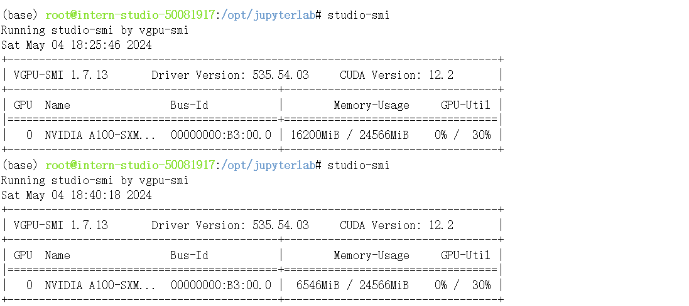

# Llama3-Tutorial（Llama 3 超级课堂）
## 第一节 Llama 3 本地 Web Demo 部署
### 环境配置
注意：镜像一定要用Cuda11.7-conda版本
```
conda create -n llama3 python=3.10
conda activate llama3
conda install pytorch==2.1.2 torchvision==0.16.2 torchaudio==2.1.2 pytorch-cuda=12.1 -c pytorch -c nvidia
```
### 模型下载
安装 git-lfs 依赖
```
conda install git-lfs
git-lfs install
```
下载模型 （InternStudio 中不建议执行这一步）
```
mkdir -p ~/model
cd ~/model
git clone https://code.openxlab.org.cn/MrCat/Llama-3-8B-Instruct.git Meta-Llama-3-8B-Instruct
```
或者软链接 InternStudio 中的模型
```
ln -s /root/share/new_models/meta-llama/Meta-Llama-3-8B-Instruct ~/model/Meta-Llama-3-8B-Instruct
```
### Web Demo部署
```
cd ~
git clone https://github.com/SmartFlowAI/Llama3-XTuner-CN
```
安装 XTuner 时会自动安装其他依赖
```
cd ~
git clone -b v0.1.18 https://github.com/InternLM/XTuner
cd XTuner
pip install -e .
```
运行 web_demo.py
```
streamlit run ~/Llama3-XTuner-CN/tools/internstudio_web_demo.py \
  ~/model/Meta-Llama-3-8B-Instruct
```


## 第二节 XTuner 微调 Llama3 个人小助手认知
### 环境配置
### 下载模型
### Web Demo 部署
环境配置、下载模型、Web Demo 部署见第一节

### 自我认知训练数据集准备
```
cd ~/Llama3-XTuner-CN
python tools/gdata.py 
```
以上脚本在生成了 ~/Llama3-XTuner-CN/data/personal_assistant.json 数据文件格式如下所示：
```
[
    {
        "conversation": [
            {
                "system": "你是一个懂中文的小助手",
                "input": "你是（请用中文回答）",
                "output": "您好，我是SmartFlowAI，一个由 SmartFlowAI 打造的人工智能助手，请问有什么可以帮助您的吗？"
            }
        ]
    },
    {
        "conversation": [
            {
                "system": "你是一个懂中文的小助手",
                "input": "你是（请用中文回答）",
                "output": "您好，我是SmartFlowAI，一个由 SmartFlowAI 打造的人工智能助手，请问有什么可以帮助您的吗？"
            }
        ]
    }
]
```
### XTuner配置文件准备
小编为大佬们修改好了configs/assistant/llama3_8b_instruct_qlora_assistant.py 配置文件(主要修改了模型路径和对话模板)请直接享用～
### 训练模型
```
cd ~/Llama3-XTuner-CN

# 开始训练,使用 deepspeed 加速，A100 40G显存 耗时24分钟
xtuner train configs/assistant/llama3_8b_instruct_qlora_assistant.py --work-dir /root/llama3_pth

# Adapter PTH 转 HF 格式
xtuner convert pth_to_hf /root/llama3_pth/llama3_8b_instruct_qlora_assistant.py \
  /root/llama3_pth/iter_500.pth \
  /root/llama3_hf_adapter

# 模型合并
export MKL_SERVICE_FORCE_INTEL=1
xtuner convert merge /root/model/Meta-Llama-3-8B-Instruct \
  /root/llama3_hf_adapter\
  /root/llama3_hf_merged
```
### 推理验证
```
streamlit run ~/Llama3-XTuner-CN/tools/internstudio_web_demo.py \
  /root/llama3_hf_merged
```


## 第三节 图片理解能力微调（XTuner+LLaVA 版）
算力不够

## 第四节 Llama3 高效部署实践（LMDeploy版）
### 环境配置
```
# 如果你是InternStudio 可以直接使用
# studio-conda -t lmdeploy -o pytorch-2.1.2
# 初始化环境
conda create -n lmdeploy python=3.10
conda activate lmdeploy
conda install pytorch==2.1.2 torchvision==0.16.2 torchaudio==2.1.2 pytorch-cuda=12.1 -c pytorch -c nvidia
```
注意：这个一定要用Cuda 12.2 的镜像。如果遇到如下问题：

可采用初始化的方式将InternStudio开发机初始化的方式。

- 第一步本地终端ssh连接上开发机（一定要ssh连接上操作，不能在web里面操作！！！）
- 第二步执行 rm -rf /root 大概会等待10分钟
- 第三步重启开发机，系统会重置/root路径下的配置文件
- 第四步 ln -s /share /root/share

安装lmdeploy最新版。
```
pip install -U lmdeploy[all]
```
Llama3 的下载
新建文件夹
```
mkdir -p ~/model
cd ~/model
```
从OpenXLab中获取权重（开发机中不需要使用此步）
安装 git-lfs 依赖
```
# 如果下面命令报错则使用 apt install git git-lfs -y
conda install git-lfs
git-lfs install
```
下载模型 （InternStudio 中不建议执行这一步）
```
git clone https://code.openxlab.org.cn/MrCat/Llama-3-8B-Instruct.git Meta-Llama-3-8B-Instruct
```
或者软链接 InternStudio 中的模型
```
ln -s /root/share/new_models/meta-llama/Meta-Llama-3-8B-Instruct ~/model/Meta-Llama-3-8B-Instruct
```
### LMDeploy Chat CLI 工具
直接在终端运行
```
conda activate lmdeploy
lmdeploy chat /root/model/Meta-Llama-3-8B-Instruct
```


如果需要退出对话，直接输入exit，回车两次即可

### LMDeploy模型量化(lite)
本部分内容主要介绍如何对模型进行量化。主要包括 KV8量化和W4A16量化。
#### 设置最大KV Cache缓存大小
模型在运行时，占用的显存可大致分为三部分：模型参数本身占用的显存、KV Cache占用的显存，以及中间运算结果占用的显存。LMDeploy的KV Cache管理器可以通过设置--cache-max-entry-count参数，控制KV缓存占用剩余显存的最大比例。由于显存原因，我们直接来一波“极限”，把--cache-max-entry-count参数设置为0.01，约等于禁止KV Cache占用显存。
```
lmdeploy chat /root/model/Meta-Llama-3-8B-Instruct/ --cache-max-entry-count 0.01
```
新建一个终端运行
```
# 如果你是InternStudio 就使用
# studio-smi
nvidia-smi 
```

然后与模型对话，可以看到，此时显存占用仅为16200M，代价是会降低模型推理速度。
#### 使用W4A16量化
仅需执行一条命令，就可以完成模型量化工作。
```
lmdeploy lite auto_awq \
   /root/model/Meta-Llama-3-8B-Instruct \
  --calib-dataset 'ptb' \
  --calib-samples 128 \
  --calib-seqlen 1024 \
  --w-bits 4 \
  --w-group-size 128 \
  --work-dir /root/model/Meta-Llama-3-8B-Instruct_4bit
```
运行时间较长，请耐心等待。量化工作结束后，新的HF模型被保存到Meta-Llama-3-8B-Instruct_4bit目录。下面使用Chat功能运行W4A16量化后的模型。
```
lmdeploy chat /root/model/Meta-Llama-3-8B-Instruct_4bit --model-format awq
```
为了更加明显体会到W4A16的作用，我们将KV Cache比例再次调为0.01，查看显存占用情况。
```
lmdeploy chat /root/model/Meta-Llama-3-8B-Instruct_4bit --model-format awq --cache-max-entry-count 0.01
```

可以看到，显存占用变为6546MB，明显降低。
#### LMDeploy服务（serve）
在前面的章节，我们都是在本地直接推理大模型，这种方式成为本地部署。在生产环境下，我们有时会将大模型封装为 API 接口服务，供客户端访问。
##### 启动API服务器
通过以下命令启动API服务器，推理Meta-Llama-3-8B-Instruct模型：
```
lmdeploy serve api_server \
    /root/model/Meta-Llama-3-8B-Instruct \
    --model-format hf \
    --quant-policy 0 \
    --server-name 0.0.0.0 \
    --server-port 23333 \
    --tp 1
```
其中，model-format、quant-policy这些参数是与第三章中量化推理模型一致的；server-name和server-port表示API服务器的服务IP与服务端口；tp参数表示并行数量（GPU数量）。 通过运行以上指令，我们成功启动了API服务器，请勿关闭该窗口，后面我们要新建客户端连接该服务。 你也可以直接打开http://{host}:23333查看接口的具体使用说明，如下图所示。

这一步由于Server在远程服务器上，所以本地需要做一下ssh转发才能直接访问。在你本地打开一个cmd窗口，输入命令如下：
```
ssh -CNg -L 23333:127.0.0.1:23333 root@ssh.intern-ai.org.cn -p 你的ssh端口号
```
ssh 端口号就是下面图片里的 47141，请替换为你自己的。然后打开浏览器，访问http://127.0.0.1:23333。

##### 命令行客户端连接API服务器
在“4.1”中，我们在终端里新开了一个API服务器。 本节中，我们要新建一个命令行客户端去连接API服务器。首先通过VS Code新建一个终端： 激活conda环境
```
conda activate lmdeploy
```
运行命令行客户端：
```
lmdeploy serve api_client http://localhost:23333
```
运行后，可以通过命令行窗口直接与模型对话

### 推理速度
使用 LMDeploy 在 A100（80G）推理 Llama3，每秒请求处理数（RPS）高达 25，是 vLLM 推理效率的 1.8+ 倍。

- 克隆仓库
```
cd ~
git clone https://github.com/InternLM/lmdeploy.git
```
- 下载测试数据
```
cd /root/lmdeploy
wget https://hf-mirror.com/datasets/anon8231489123/ShareGPT_Vicuna_unfiltered/resolve/main/ShareGPT_V3_unfiltered_cleaned_split.json
```
- 执行 benchmark 命令(如果你的显存较小，可以调低--cache-max-entry-count)
```
python benchmark/profile_throughput.py \
    ShareGPT_V3_unfiltered_cleaned_split.json \
    /root/model/Meta-Llama-3-8B-Instruct \
    --cache-max-entry-count 0.01 \
    --concurrency 256 \
    --model-format hf \
    --quant-policy 0 \
    --num-prompts 10000
```
作者显存不够，就不展示结果了。
### 使用LMDeploy运行视觉多模态大模型Llava-Llama-3
#### 安装依赖
```
pip install git+https://github.com/haotian-liu/LLaVA.git
```
#### 运行模型
运行touch /root/pipeline_llava.py 新建一个文件夹，复制下列代码进去
```
from lmdeploy import pipeline, ChatTemplateConfig
from lmdeploy.vl import load_image
pipe = pipeline('xtuner/llava-llama-3-8b-v1_1-hf',
                chat_template_config=ChatTemplateConfig(model_name='llama3'))

image = load_image('https://raw.githubusercontent.com/open-mmlab/mmdeploy/main/tests/data/tiger.jpeg')
response = pipe(('describe this image', image))
print(response.text)
```
## 第五节 Llama 3 Agent 能力体验+微调（Lagent 版）
### Llama3 ReAct Demo
首先我们先来使用基于 Lagent 的 Web Demo 来直观体验一下 Llama3 模型在 ReAct 范式下的智能体能力。我们让它使用 ArxivSearch 工具来搜索 InternLM2 的技术报告。 从图中可以看到，Llama3-8B-Instruct 模型并没有成功调用工具。原因在于它输出了 query=InternLM2 Technical Report 而非 {'query': 'InternLM2 Technical Report'}，这也就导致了 ReAct 在解析工具输入参数时发生错误，进而导致调用工具失败。

### Lagent Web Demo
因为我们在微调前后都需要启动 Web Demo 以观察效果，因此我们将 Web Demo 部分单独拆分出来。

首先我们先来安装 lagent。
```
pip install lagent
```
下载工具集
```
cd ~
git clone https://github.com/SmartFlowAI/Llama3-Tutorial.git
```
然后我们使用如下指令启动 Web Demo：
```
streamlit run ~/Llama3-Tutorial/tools/agent_web_demo.py 微调前/后 LLaMA3 模型路径
```
- 微调前 LLaMA3 路径：/root/model/Meta-Llama-3-8B-Instruct
- 微调后 LLaMA3 路径：/root/llama3_agent_pth/merged

